# DATA

## Train set

>총 6,997개로 5명이 만든 데이터로 이루어져 있습니다.

## test set

>총 1389개로 김지원님 1명으로 이루어져 있습니다.

# Train Architecture

## CNN_ONLY

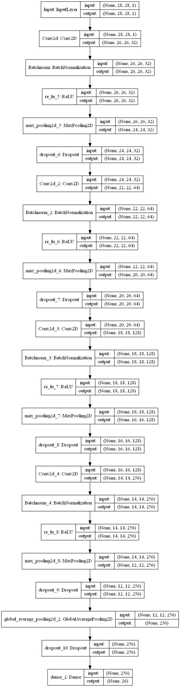

## CNN 2D + CNN 1D

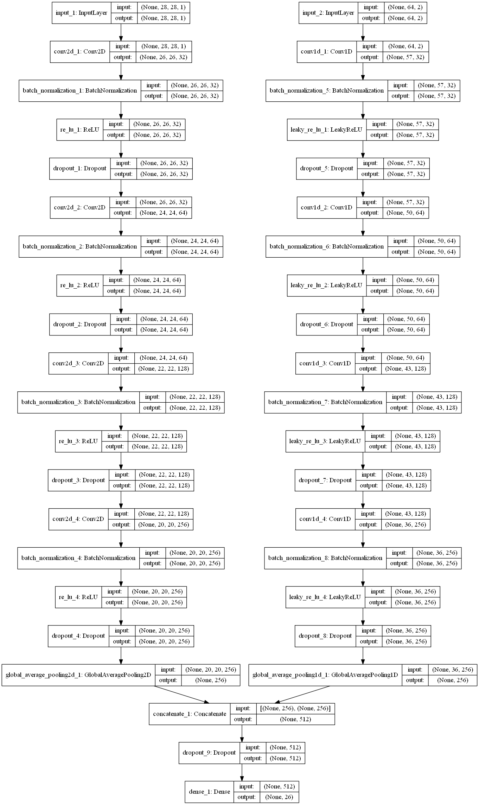

# Data Augmentation

## Sequence augmentation

### Jitter
> 랜덤한 10개의 index에 노이즈를 추가합니다.

### TimeWarp

1. 정규분포로 random한 점들을 뽑아냅니다.
2. 뽑아낸 점들을 CubicSpline을 이용하여 곡선을 만듭니다.
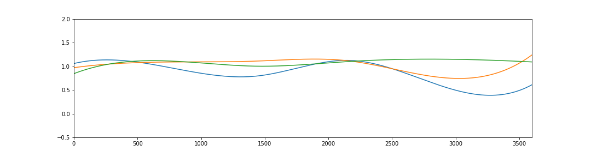
3. 만든 랜덤한 곡선을 점진적으로 더한 곡선을 만듭니다.
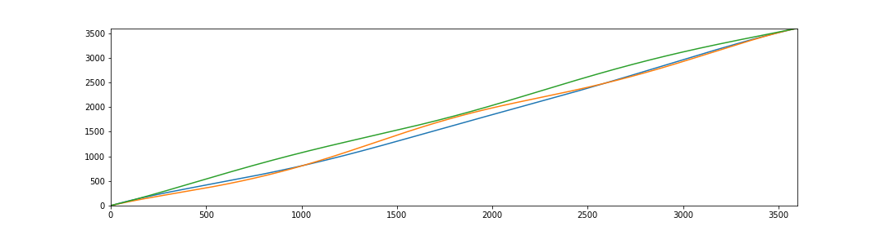
4. 점진적으로 더한 곡선을 x축으로 하여 보간법으로 적용합니다.

### Random sampling
> 데이터에서 랜덤하게 점들을 뽑고 이를 보간법을 이용하여 새로운 곡선을 만듭니다.
## GAN
> WGAN(Wassestein GAN)에서 모델을 LSTM과 CNN1D로 바꾸어 Sequence 데이터를 생성하였습니다.

### Architecture

### Generator_model
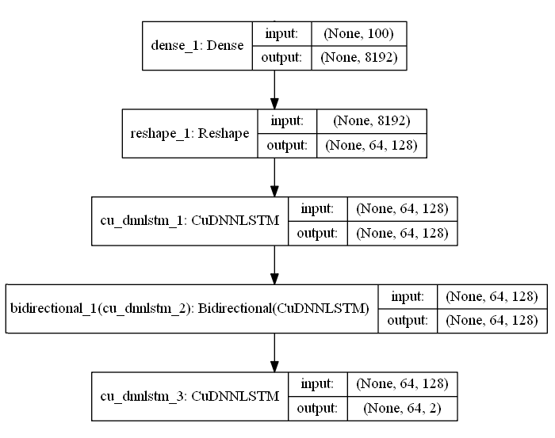

CNN을 LSTM으로 바꾸었습니다.

### Critic_model
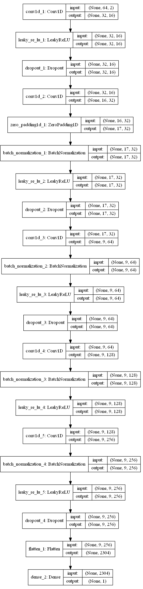

CNN을 Conv1d으로 바꾸었습니다.

### Result

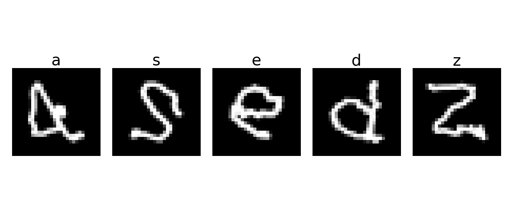

데이터가 잘 생성된 것을 알 수 있습니다.

## Accuracy

### Before Augmentation

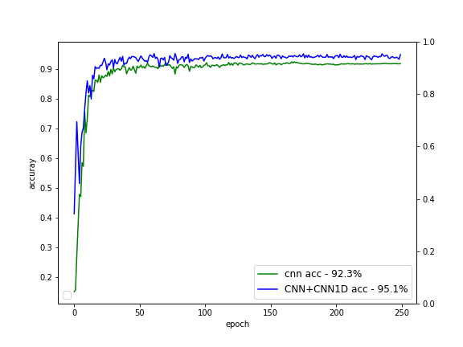

CNN보다 CNN1D를 추가했을떄 Accuracy가 2.8% 더 높았습니다.

### After Augmentation

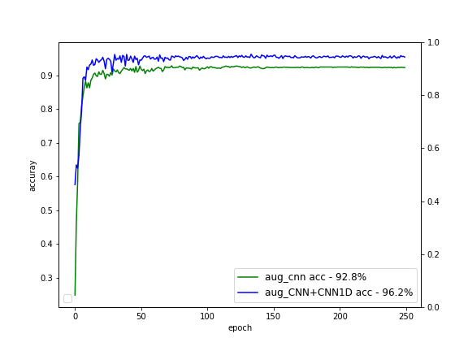

Data augmentation한 결과 CNN은 0.5% CNN+CNN1D는 1.1% 증가 하였습니다.
## Confusion map

### Before Augmentation

### CNN
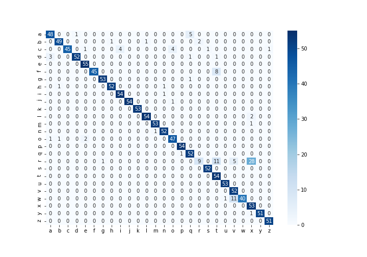

cnn같은경우 r을 x로 잘못 인식 하고 f와 t를 구별하지 못합니다.

### CNN + CNN1D
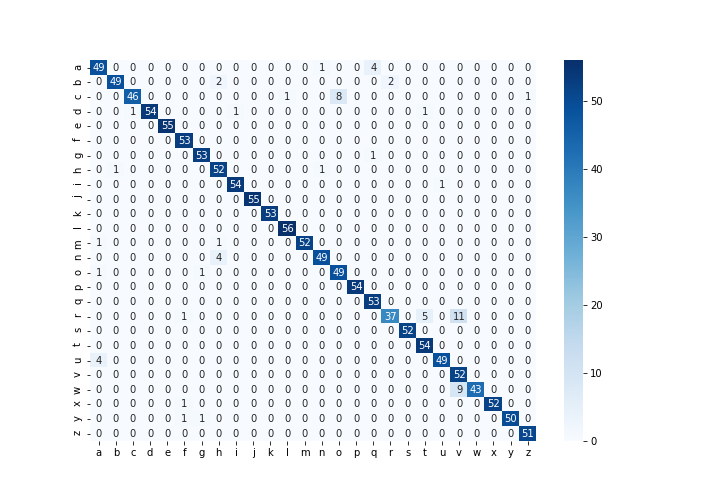

cnn + cnn1d는 r과 v를 구별하지 못합니다. 하지만 CNN과 달리 r과 x는 구별 할 수 있습니다.

> test set에서 r이 train set에서는 찾을 수 없는 r의 모양을 한 것으로 보입니다.

### After Augmentation
미묘한 차이 밖에 보이지 않습니다.
### CNN

### CNN + CNN1D

## Error example

### CNN

### CNN + CNN1D

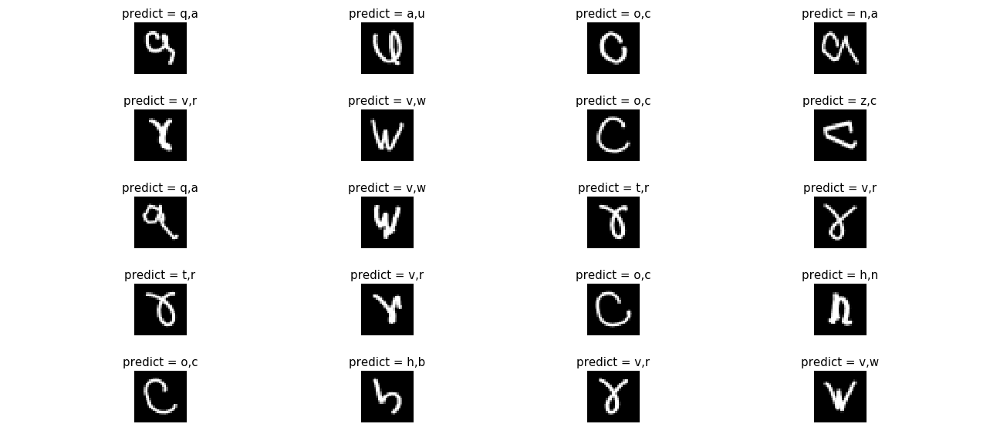

### 고찰

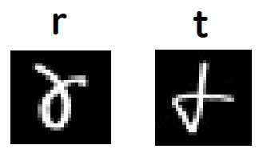

> test set의 r은 train set의 t와 모양과 쓰는 순서가 비슷하여 CNN, CNN+CNN1D 모두에서 큰 Error를 보였습니다.

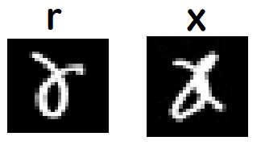
> r과 x는 모양이 비슷하지만 쓰는 순서가 다르기에 CNN에서만 큰 Error를 보였습니다.
